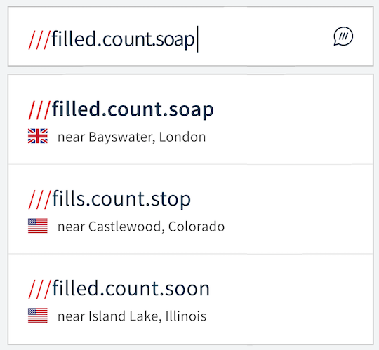
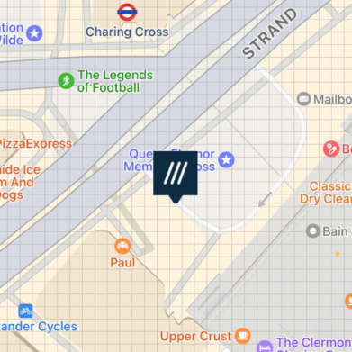

# &nbsp;w3w-swift-samples

# Overview

Multiple example apps using our wrappers and components.  These show how to use our libraries to easily incorporate functionality into your app such as:

* Call our API
* Use our text field with drop down suggestions
* Easily show a map with our gridlines
* Voice to three word address
* Image or Video to three word address (OCR)

All of these examples require an **API Key** which you can get for free from our developer website: [developer.what3words.com](https://developer.what3words.com/public-api).

# Examples:

The examples are in folders in the root of this repository with names corresponding to the heading of each example description below.

## API

These examples use our "API Wrapper", which is primarily a Swift Package called [w3w-swift-wrapper](https://github.com/what3words/w3w-swift-wrapper). This provides an easy way to call our API service. 

#### AutoSuggest

This SwiftUI example shows a simple call to `autosuggest` where it uses the `options` to filter by country.  In this case Great Britain.  Use this to play with autosuggest options and see the various results.

#### AutosuggestHelperSwiftUI

Autosuggest helper is an object that does all the API service calling for cases like a text input field.  Here we use SwiftUI to make a textField with dropdown "suggestions" using Autosuggest Helper to power it.  It has a built-in 'debouncer' that will limit the calls to the server in cases where input might change at the speed of someone typing.

#### AutosuggestPlusYourData

An iOS example using `W3WAutosuggestHelper` to augment another address datasource.  In other words, it shows how to use what3words with another address service.  The example uses Apple's `MKLocalSearchCompleter` and mixes its results with what3words suggestions.

#### ConvertToCoords

A macOS terminal example demonstrating `convertToCoordinates`.

#### GridLines

An iOS example using MapKit to show what3words gridlines on a map.  This annotates an MKMapView with gridlines to delineate three word address squares.  However, this is an example of how to do it from scratch. If you want this functionality in an easy-to-use package, you might instead look at the example below called MapComponent.  Our map component does a lot more heavy lifting when it comes to maps.  There is also a Map Helper that brings only the functionality you want to your map.

## Autosuggest Component

#### TextField

This example shows how to use our Autosuggest Component.  It is a UITextField derivative called `W3WAutosuggestTextField`  that shows suggestions as the user types in a dropdown field.

#### SearchController

This example shows how to use our Autosuggest Component for Search Controllers.  It is a UISearchController derivative called `W3WAutosuggestTextField`  that shows suggestions as the user types in a dropdown field.

#### TextFieldObjectiveC

This is an example of our Autosuggest Component written in Objective C.

## Map

#### MapComponent

This demonstrates `W3WMapViewController` which is a high-level component that has easy-to-use what3words functionality.   If you already have a map in your application then you will want to use `W3WMapHelper` to add the what3words grid and  pins to your map.  A MapHelper example is described below.  If you have no map in your app and want to quickly include one with some default behaviours then it's easy to include this one.

#### MapHelper

If you have a ViewController that has a map, `W3WMapHelper` provides convenience functions to add to your `MKMapViewDelegate` functions for what3words grid and pin annotations to appear on your map.  This example shows where you would place the calls, and how to instantiate the `W3WMapHelper`.

#### MapView

We created W3WMapView as a quick and dirty way to quickly get what3words functionality into your app.  Simply replace your MKMapView with W3WMapView, and your app should behave the same as before except it will draw what3words grid lines, and have some new functions available, like `addMarker(at: "filled.count.soap")`. Apple does not recommend deriving new objects from MKMapView as its interface could change in the future, so view this as a quick and dirty way to get the functionality into your app. The better approach would be to use `W3WMapHelper` which is designed to fit nicely into your `MKMapViewDelegate` conforming class, presumably a UIViewController.

## OCR (Optical Character Recognition)

#### OcrComponent

This demonstrates our `W3WOcrViewController` which uses the camera to scan for three-word addresses.  It uses our OCR systems which conform to our `W3WOcrProtocol`.  We include a class called `W3WOcrNative` which does and uses Apple's Vision Framework to employ hardware-accelerated optical character recognition.

## Voice

### VoiceAPI

This example shows how to use our Voice API to recognise a spoken three word address.
